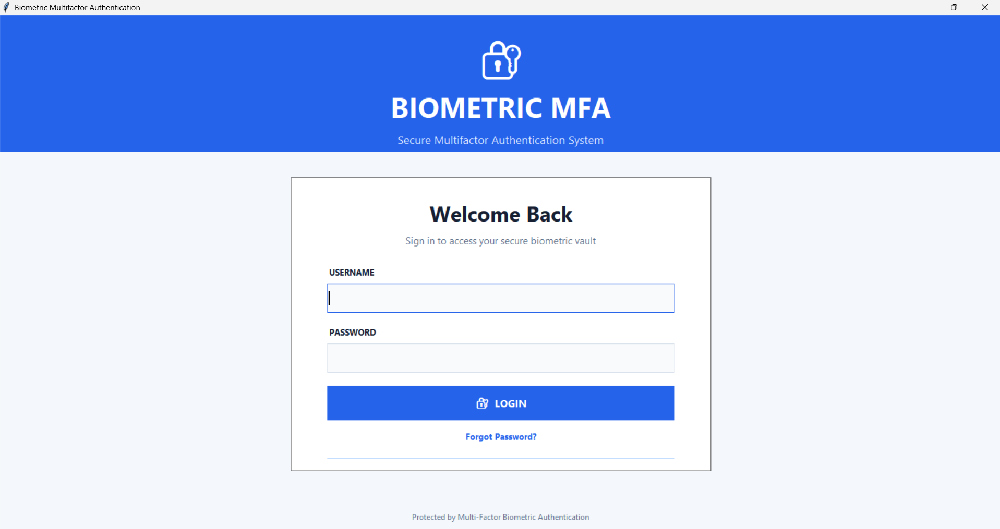
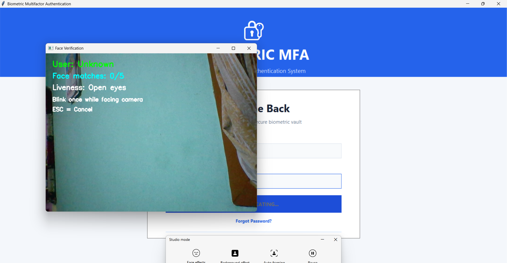
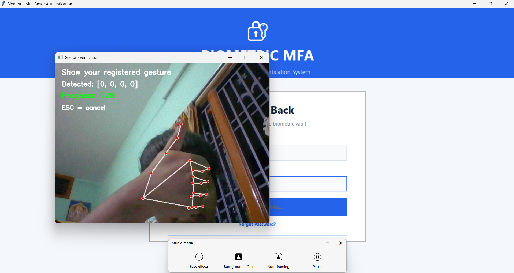
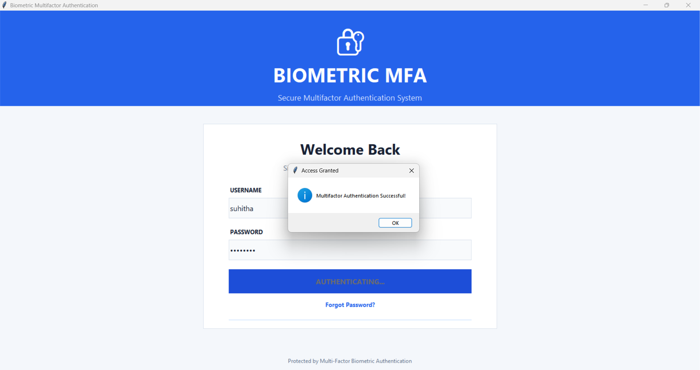
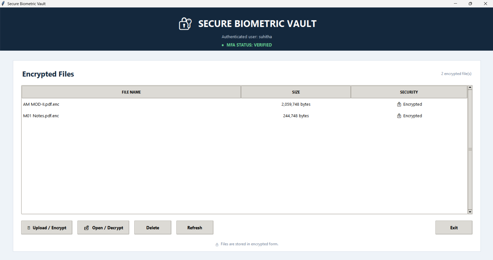
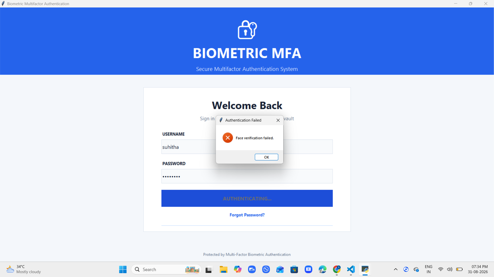
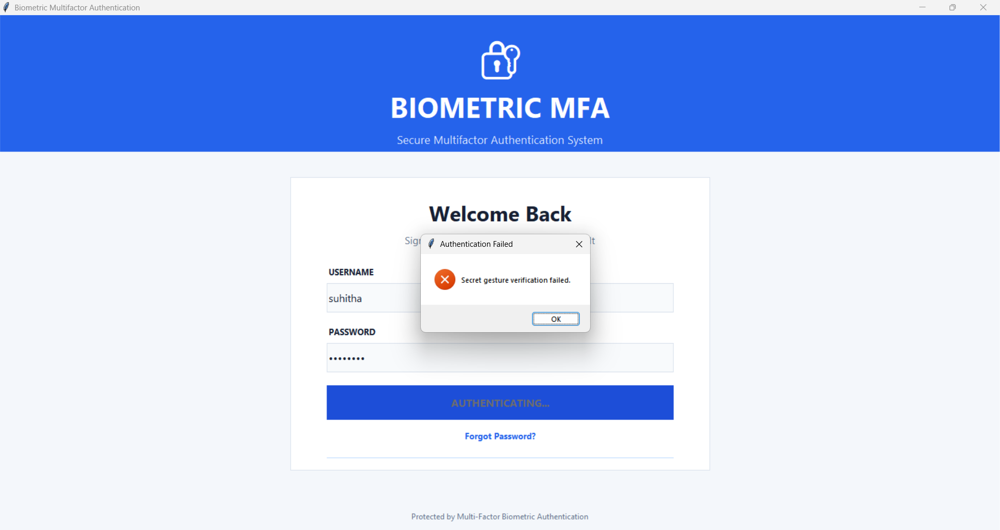

# 🔐 Biometric MFA V2

### Secure Multifactor Authentication & Encrypted File Vault

A Python-based desktop application that combines **password authentication, face recognition, liveness detection, and secret hand gesture verification** to provide secure access to a personal encrypted file vault.

---

## ✨ Features

- 🔑 Username + Password authentication
- 👤 Face Recognition
- 👁️ Blink-based Liveness Detection
- ✋ Secret Hand Gesture Verification
- 🔒 Fernet-encrypted File Vault
- 📝 Authentication Logging
- 🚨 Intruder Detection
- 🔐 OTP-based Password Reset
- 👨‍💼 Admin User Management

---

## 🛠️ Technologies Used

- **Python** – Core programming language
- **Tkinter** – Graphical User Interface
- **OpenCV** – Face recognition and camera processing
- **MediaPipe** – Hand gesture detection
- **SQLite** – User and authentication data storage
- **bcrypt** – Secure password hashing
- **Cryptography (Fernet)** – Encrypted file vault
- **Git & GitHub** – Version control and project hosting

---

## 🔄 Project Process

```text
Start Application
       ↓
Login Screen
       ↓
Username + Password
       ↓
Password Verification
       ↓
Face Verification
       ↓
Liveness Check
       ↓
Secret Hand Gesture
       ↓
Authentication Successful
       ↓
Secure Biometric Vault
       ↓
Upload / Encrypt / Open / Decrypt / Delete
```

If any required authentication step fails:

```text
Authentication Failure
        ↓
Access Denied
```

---

## 📁 Project Structure

```text
mfa_v2/
│
├── screenshots/
│   ├── 01_login_screen.png
│   ├── 02_face_verification.png
│   ├── 03_gesture_verification.png
│   ├── 04_successful_authentication.png
│   ├── 05_secure_biometric_vault.png
│   ├── 06_gesture_failed.png
│   └── 07_face_failed.png
│
├── admin_panel.py
├── app.py
├── dashboard.py
├── database.py
├── face_auth.py
├── gesture_detection.py
├── gesture_register.py
├── gui_login.py
├── password_reset.py
├── register_face.py
├── reset_user.py
├── run.py
├── test_camera.py
├── train_faces.py
├── haarcascade_frontalface_default.xml
├── requirements.txt
├── .gitignore
└── README.md
```

---

## ⚙️ Project Setup

### 1. Clone the Repository

```powershell
git clone https://github.com/Suhitha-N/Biometric-MFA-V2.git
cd Biometric-MFA-V2
```

### 2. Create Virtual Environment

```powershell
python -m venv venv
```

### 3. Activate Virtual Environment

```powershell
.\venv\Scripts\Activate.ps1
```

### 4. Install Dependencies

```powershell
pip install -r requirements.txt
```

### 5. Run the Project

```powershell
python gui_login.py
```

### Quick Run

```powershell
cd .\mfa_v2
.\venv\Scripts\Activate.ps1
python gui_login.py
```

---

## 👤 User Registration

```text
Admin Login
     ↓
Add User
     ↓
Register Face
     ↓
Train Face Model
     ↓
Register Secret Gesture
     ↓
User Login
```

---

## 🔐 Authentication Workflow

### 1. Login Screen

Enter the registered username and password.



### 2. Face Verification

The application verifies the registered face and performs the liveness check.



### 3. Secret Gesture Verification

The user performs the registered secret hand gesture.



### 4. Successful Authentication

After successful verification, access is granted.



### 5. Secure Biometric Vault

The authenticated user can manage encrypted files.



---

## ❌ Failed Authentication

### Face Verification Failed



### Gesture Verification Failed



When a required authentication factor fails, the system denies access.

---

## 🔒 Secure Biometric Vault

After successful MFA, the user can:

- Upload and encrypt files
- Open and decrypt files
- Delete encrypted files
- Refresh the file list

```text
Select File
     ↓
Encrypt
     ↓
Store Securely
     ↓
Decrypt when required
```

---

## 🛡️ Security

The project uses multiple security layers:

- Password hashing with bcrypt
- Face verification
- Liveness detection
- Secret gesture verification
- Encrypted file storage
- Authentication logs
- OTP password reset
- Intruder handling
- Admin controls

---

## ⚠️ Public Repository

Do not upload personal or sensitive data to GitHub.

Keep the following local:

```text
venv/
dataset/
models/
intruders/
logs/
secure_files/
secure_storage/
users.db
```

These files are excluded using `.gitignore`.

---

## 🎯 Project Objective

The objective of **Biometric MFA V2** is to provide a secure desktop authentication system by combining **password, face, liveness, and gesture verification** before granting access to an encrypted file vault.

**Biometric MFA V2** demonstrates the practical use of **biometric authentication, computer vision, gesture recognition, encryption, database management, and secure file storage**.
